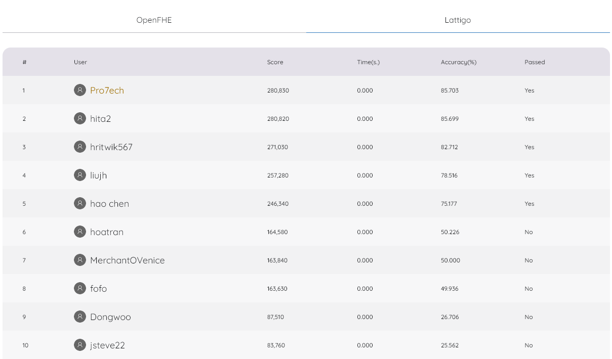

# FHERMA RELU CHALLENGE

## This solution managed to get the best score for the Lattigo submissions of the [ReLU](https://fherma.io/challenges/6542c282100761da3b545c3e/overview) challenge.

	

## This solution requires a modified version of Lattigo:
- `hefloat.MinimaxCompositePolynomialEvaluator` has been modified to not panic if `he.Bootstrapper[rlwe.Ciphertext]` is nil.

## Testing solution

- `$ make test-0` to run the first challenge setup (depth 12)
- `$ make test-1` to run the second challenge setup (depth 3)
